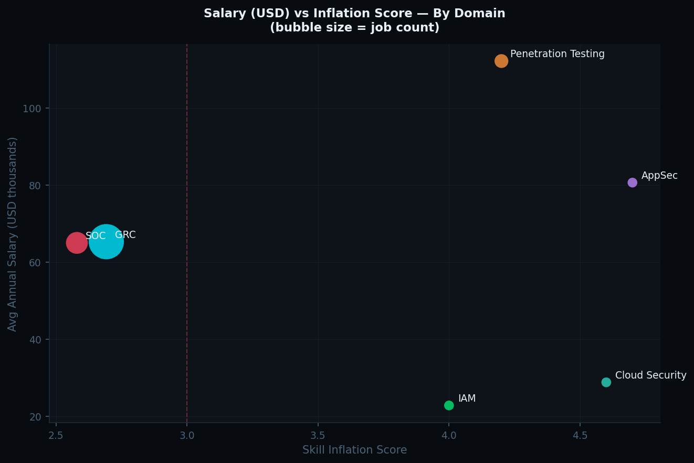

# 📊 Cybersecurity Skill Inflation Index (CSII)

> **Industry-wide intelligence engine tracking skill inflation, exploitation signals, and salary gaps across all cybersecurity domains.**

[](https://github.com/YOUR-USERNAME/Cybersecurity-Skill-Inflation-Index/actions/workflows/csii.yml)


---

## ⚠️ Industry Signal — February 2026

> 🔴 **HIGH INFLATION** — Global score **3.32**, above the 3.0 threshold. AppSec and Cloud Security are the most exploitative domains. **53% of all listings** flagged for exploitation signals.

| Metric | Value | Signal |
|--------|-------|--------|
| 📈 Global Skill Inflation Score | **3.32** | 🔴 High — above threshold |
| 📅 Avg Years Required | **4.4 yrs** | 🔴 Rising across all domains |
| 🧠 Avg Certifications Demanded | **3.2** | 🔴 Cert creep industry-wide |
| 🛠️ Avg Tools Required | **1.8** | 🟡 Growing complexity |
| ⚠️ Exploitation Rate | **53%** | 🔴 Majority of listings flagged |
| 💰 Avg Salary (USD) | **~$72,000** | 🟡 Not keeping pace |
| 💼 Total Jobs Analyzed | **19** | ✅ 6 domains covered |

---

## 📈 Global Inflation Trend


---

## 🏛️ Domain Intelligence

### Inflation Score by Domain


| Domain | Avg Years | Avg Certs | Score | Signal |
|--------|-----------|-----------|-------|--------|
| AppSec | 5.0 | 4.0 | 🔴 **4.70** | Severe — most tool-heavy domain |
| Cloud Security | 4.0 | 3.0 | 🔴 **4.60** | Multi-cloud complexity explosion |
| Penetration Testing | 4.5 | 3.5 | 🔴 **4.20** | OSCP not enough anymore |
| IAM | 4.0 | 3.0 | 🔴 **4.00** | Platform cert stacking |
| SOC | 3.5 | 2.5 | 🔴 **3.20** | SIEM + EDR now baseline |
| GRC | 3.2 | 3.4 | 🟡 **2.92** | High certs, lower tool demand |

---

### Job Distribution by Domain


---

### Exploitation Rate by Domain


---

### Seniority Distribution by Domain


---

### Salary vs Inflation Score — By Domain



> Domains in the top-left (high salary, low score) = good value. Bottom-right (low salary, high score) = exploitation.

---

## 🌍 Country Intelligence


| Market | Avg Yrs | Score | Signal |
|--------|---------|-------|--------|
| 🇸🇬 Singapore | 5.5 | 🔴 4.20 | Severe |
| 🇭🇰 Hong Kong | 6.5 | 🔴 4.10 | Severe |
| 🇦🇪 UAE | 3.0 | 🟡 2.70 | Moderate |
| 🇮🇳 India | 3.2 | 🟡 2.80 | Moderate |
| 🇬🇧 UK | 4.0 | 🟡 2.90 | Moderate |
| 🇺🇸 USA | 3.5 | 🔴 3.10 | High |

---

## 🏆 Certification Demand — Industry-Wide


---

## 🛠️ Tool Demand — Industry-Wide


---

## ⚠️ Exploitation Detector


| Flag | Meaning |
|------|---------|
| `EXPERIENCE_INFLATION` | Junior title + 5+ years demanded |
| `CERT_OVERLOAD` | 5+ certifications in one posting |
| `TOOL_STACK_ABUSE` | 4+ tools demanded simultaneously |
| `UNDERPAID_EXPERIENCED` | 3+ yrs required + salary < $30K USD |
| `SENIOR_EXPLOITATION` | 8+ yrs + 3+ certs + 2+ tools |

---

## 💰 Salary vs Experience


---

## 📅 Historical Index

| Month | Avg Years | Avg Certs | Avg Tools | Skill Score | Jobs |
|-------|-----------|-----------|-----------|-------------|------|
| 2026-02 | 3.78 | 2.74 | 2.30 | **3.03** | 23 |
## 🔍 What Is CSII?

The **Cybersecurity Skill Inflation Index** tracks whether employers across all cybersecurity domains are raising job requirements faster than compensation — a structural market trend that distorts career planning and hiring.

**Domains Tracked:**

| Domain | Focus |
|--------|-------|
| 🔵 GRC | Governance, Risk, Compliance, Audit |
| 🔴 SOC | Threat Detection, Incident Response, SIEM |
| 🟠 Penetration Testing | Offensive Security, Red Team, Vuln Assessment |
| 🩵 Cloud Security | AWS/Azure/GCP Security, DevSecOps, CSPM |
| 🟣 AppSec | Secure SDLC, SAST/DAST, Code Review |
| 🟢 IAM | Identity Governance, PAM, SSO, Zero Trust |

**Scoring Formula:**
```
Skill_Score = (Avg_Years × 0.4) + (Avg_Certs × 0.3) + (Avg_Tools × 0.3)
```

| Score | Signal |
|-------|--------|
| `< 2.0` | 🟢 Healthy market |
| `2.0–3.0` | 🟡 Moderate inflation |
| `> 3.0` | 🔴 High inflation — requirements outpacing value |

---

## ⚙️ Pipeline

```
data/raw/YYYY-MM/*.txt
        ↓ extract_metrics.py
          → Domain auto-classifier (6 domains)
          → Seniority classifier (Junior/Mid/Senior)
          → Salary normalizer (→ USD)
          → Country extractor (20+ markets)
          → Exploitation detector (5 flags)
        ↓ calculate_index.py
          → Global index
          → Domain index (per-domain scores)
          → Country index (per-market scores)
        ↓ generate_report.py
          → 12 charts (dark theme, auto-generated)
          → README badges auto-updated
          → Monthly report committed
        ↓ GitHub Actions (daily cron)
```

---

## 📂 Structure

```
Cybersecurity-Skill-Inflation-Index/
├── data/
│   ├── raw/YYYY-MM/              ← Add job_XXX.txt files here
│   └── processed/
│       ├── YYYY-MM.csv           ← Per-job: domain, seniority, salary_usd, anomaly
│       ├── monthly_index.csv     ← Global scores over time
│       ├── domain_index.csv      ← Per-domain scores over time
│       └── country_index.csv     ← Per-country scores over time
├── reports/                      ← 12 auto-generated charts + monthly report
├── scripts/
│   ├── extract_metrics.py        ← Domain-aware extraction engine
│   ├── calculate_index.py        ← Global + domain + country scoring
│   └── generate_report.py        ← 12-chart report generator
├── requirements.txt
└── .github/workflows/csii.yml
```

---

## 📋 Job Format

```
Title: SOC Analyst Level 2
Company: Company Name
Location: City, Country
Salary: USD 90,000 annually

Job Description:
Full text here. Domain is auto-detected from title and content.
Optionally add: Domain: SOC  (to override auto-detection)
```

**Supported domains for override:** `GRC` · `SOC` · `Penetration Testing` · `Cloud Security` · `AppSec` · `IAM`

---

## 🗺️ Roadmap

- [x] 6-domain tracking engine
- [x] Domain auto-classifier
- [x] Seniority classifier
- [x] Salary normalizer (→ USD)
- [x] Country segmentation
- [x] Exploitation detector (5 flags)
- [x] 12 automated dark-theme charts
- [x] README badge auto-update
- [ ] 6-month forecast model
- [ ] GitHub Pages live dashboard
- [ ] Multi-year trend analysis
- [ ] Domain-specific cert ROI scoring

---

*Tracking the full cybersecurity job market. Auto-updated via GitHub Actions.*

---

**3. Trigger first run:**
```
Actions tab → CSII Automated Intelligence Engine → Run workflow
```

That's it. Every Monday the workflow will:
1. Pull fresh cybersecurity job listings from all sources
2. Auto-detect domain (GRC / SOC / Pentest / Cloud / AppSec / IAM)
3. Extract metrics and calculate inflation scores
4. Regenerate all 12 charts
5. Update README badges
6. Commit everything back to the repo

### Manual Collection (No API)

You can still add jobs manually alongside automated collection:
```
data/raw/YYYY-MM/job_XXX.txt
```
Manual files are processed identically to automated ones.

---
