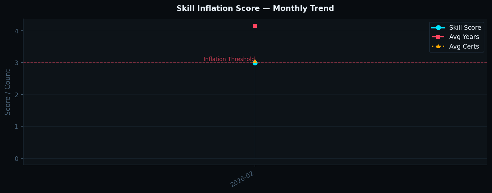
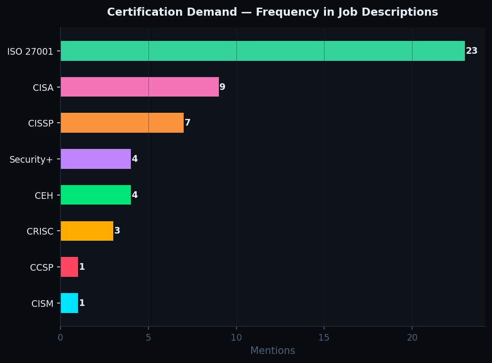
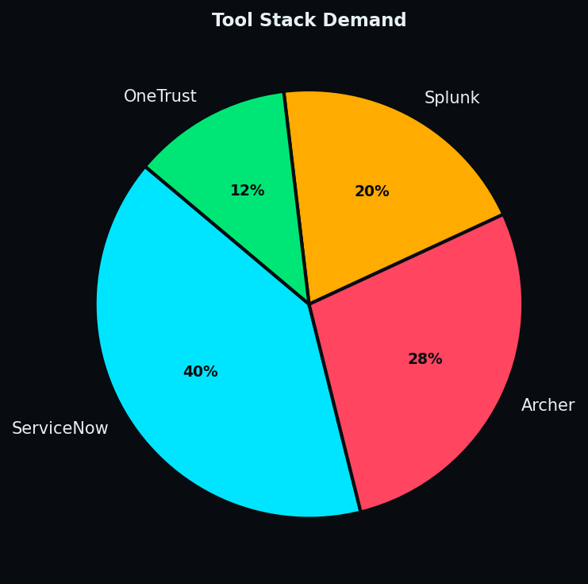
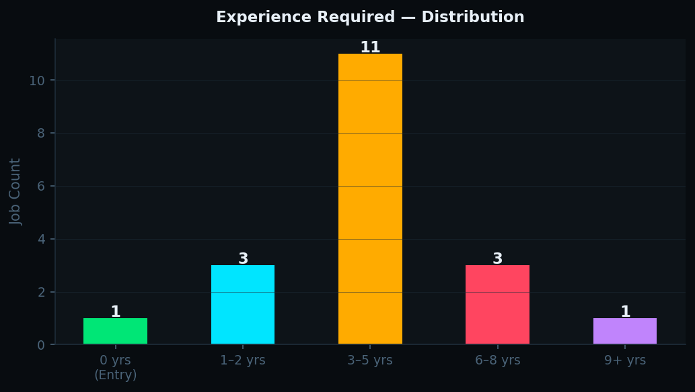
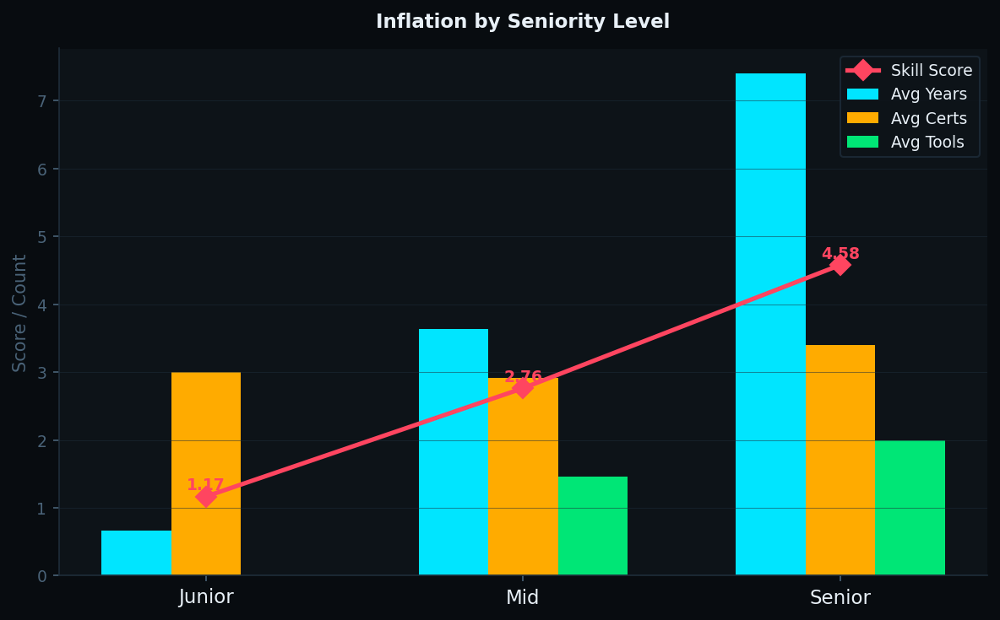
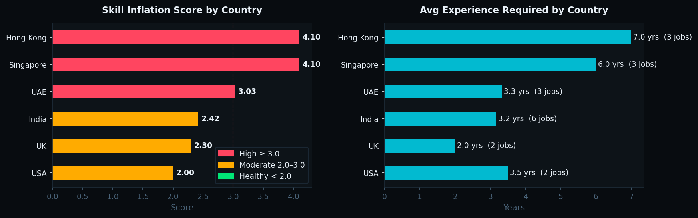
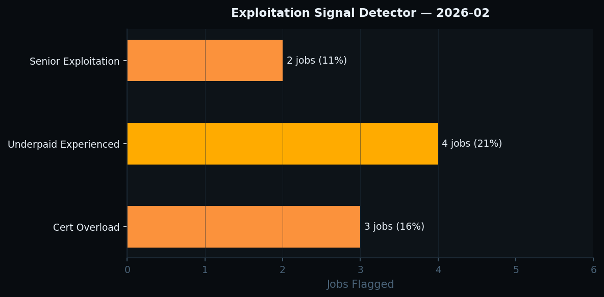
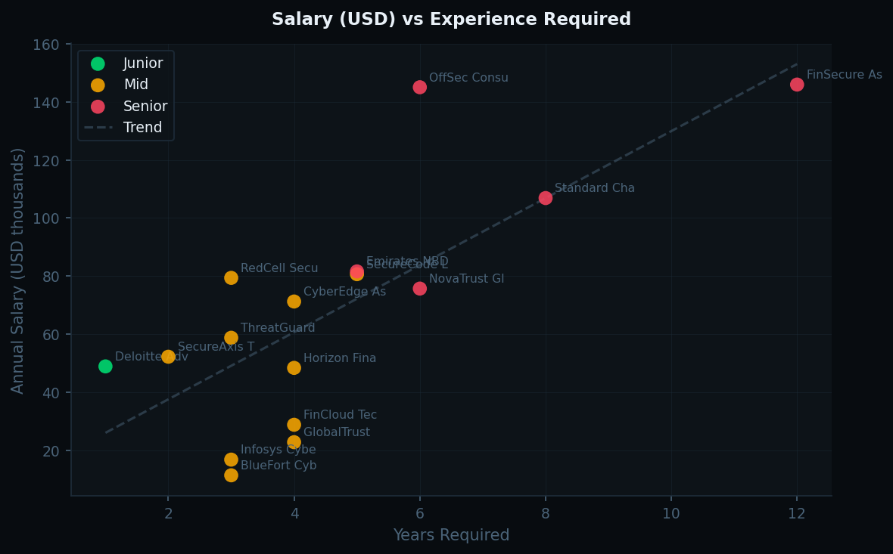

# CSII Monthly Report — 2026-02

## Signal
🟡 **MODERATE INFLATION** — Monitor closely.

## Key Metrics
| Metric | Value |
|--------|-------|
| Avg Years Required | 4.16 |
| Avg Certifications | 3.05 |
| Avg Tools | 1.37 |
| Avg Frameworks | 2.79 |
| **Skill Inflation Score** | **2.99** |
| Jobs Analyzed | 19 |
| Avg Salary (USD) | $67,147 |
| Exploitation Rate | 42.1% |
| Junior / Mid / Senior | 3 / 11 / 5 |

## Charts

