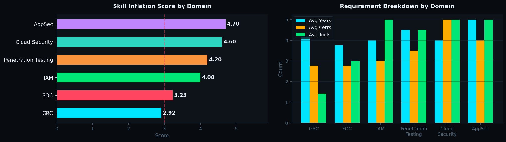
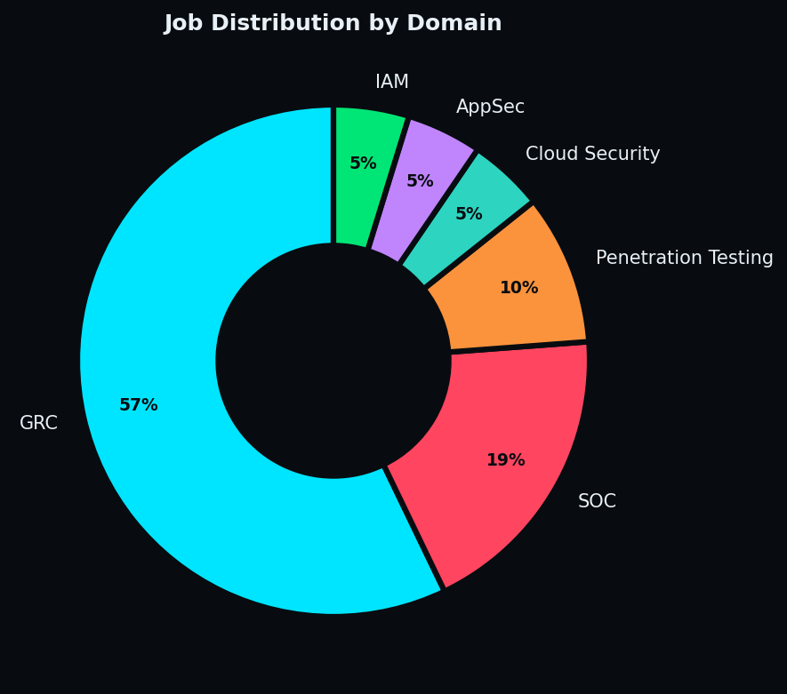
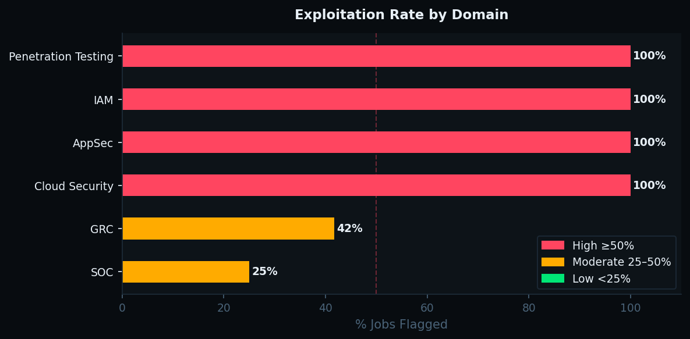
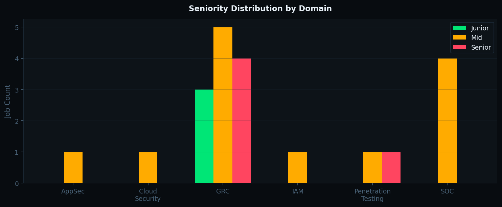

# CSII Monthly Report — 2026-02

## Signal: 🔴 **HIGH INFLATION**

## Global Metrics
| Metric | Value |
|--------|-------|
| Avg Years Required | 4.14 |
| Avg Certifications | 3.00 |
| Avg Tools | 2.52 |
| **Skill Inflation Score** | **3.31** |
| Avg Salary (USD) | $67,147.0 |
| Exploitation Rate | 52.4% |
| Jobs Analyzed | 21 |

## Domain Breakdown
| Domain | Avg Years | Avg Certs | Score | Signal | Jobs |
|--------|-----------|-----------|-------|--------|------|
| AppSec | 5.0 | 4.0 | 4.70 | 🔴 | 1 |
| Cloud Security | 4.0 | 5.0 | 4.60 | 🔴 | 1 |
| Penetration Testing | 4.5 | 3.5 | 4.20 | 🔴 | 2 |
| IAM | 4.0 | 3.0 | 4.00 | 🔴 | 1 |
| SOC | 3.8 | 2.8 | 3.23 | 🔴 | 4 |
| GRC | 4.2 | 2.8 | 2.92 | 🟡 | 12 |

## Charts
 
 
 
 
 
